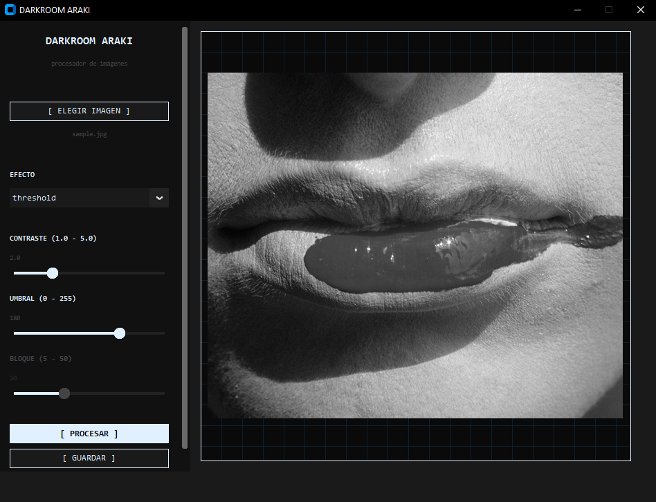
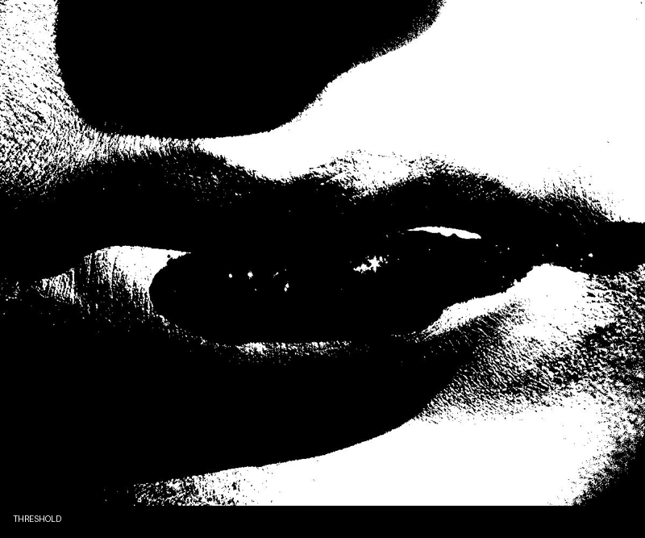

# DARKROOM ARAKI 


---

## 📸 Algoritmos disponibles

| Algoritmo | Descripción |
|---|---|
| **Threshold** | Convierte cada píxel a blanco o negro puro según un umbral definido. |
| **Floyd-Steinberg** | Convierte a blanco y negro distribuyendo el error de cada píxel a sus vecinos, generando un grano orgánico. |
| **Bayer** | Convierte a blanco y negro comparando cada píxel contra una matriz matemática fija que se repite como mosaico. |
| **Halftone líneas** | Representa el brillo de la imagen mediante líneas verticales de distinto grosor. |
| **Halftone puntos** | Representa el brillo de la imagen mediante puntos de distinto tamaño. |
| **Solarización** | Imitación algorítmica de una técnica descubierta accidentalmente por el artista visual Man Ray en el cuarto oscuro, que consiste en invertir parcialmente los tonos de la imagen. |

---

## 🖥️ Interfaz



---

## 🖼️ Ejemplos

Cada imagen fue procesada con un algoritmo distinto aplicado sobre la misma fotografía. Se presentan en formato GIF para visualizar las diferencias entre cada resultado.



---

## ⚙️ Instalación

**1 — Cloná el repositorio**
```bash
git clone https://github.com/naylamarie/darkroom-araki.git
cd darkroom-araki
```

**2 — Instalá las dependencias**
```bash
pip install pillow numpy customtkinter
```

**3 — Ejecutá la aplicación**
```bash
python main.py
```

---

## 📁 Estructura del proyecto
```
darkroom-araki/
│
├── main.py                  → punto de entrada
├── gui.py                   → interfaz gráfica
├── algoritmos/
│   ├── __init__.py
│   ├── floyd_steinberg.py
│   ├── threshold.py
│   ├── bayer.py
│   ├── halftone_lineas.py
│   ├── halftone_puntos.py
│   └── solarizacion.py
├── imagenes/                → imagen de muestra y material de presentación
├── resultados/              → imágenes procesadas
└── README.md
```

---

## 💡 Sobre el proyecto

Darkroom Araki es una herramienta que trabaja sobre imágenes mediante algoritmos. Nació del interés por entender cómo funciona cada algoritmo desde adentro y usarlos de forma creativa.

